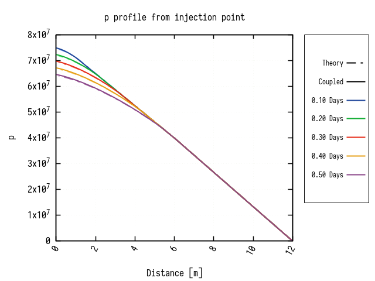
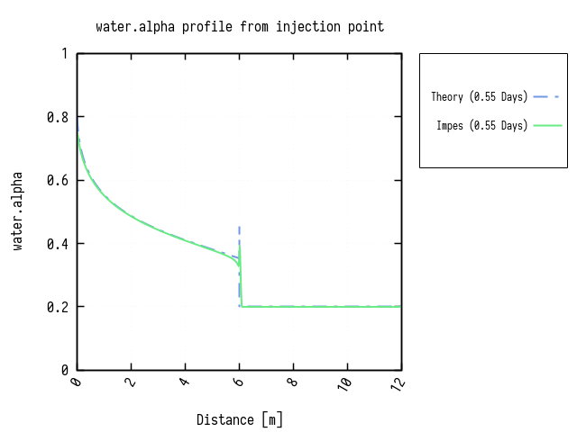

# Buckley-Leverett Test Case

A one-dimensional, horizontal and immiscible displacement of oil by water is
simulated for a linear portion (12m) of a reservoir with unit thickness and 
unit cross-section area.

The flow domain is composed of two different rocks where only the relative
permeability curves differ.

> The flow is horizontal (Gravity neglected) and we assume no capillary effects

## Rock and fluid parameters

The following table summarises used parameters for the test case (All in SI units)

| Parameter                  | Rock 1       | Rock 2       |
| ---------------            | ------------ | ------------ |
| Porosity                   | 0.3          | 0.3          |
| Permeability               | 1e-14        | 1e-14        |
| Length                     | 6.0          | 6.0          |
| Injector rate              | 1e-5         | ---          |
| Water dynamic viscosity    | 1e-3         | 1e-3         |
| Water density              | 1e3          | 1e3          |
| Oil dynamic viscosity      | 1e-5         | 1e-5         |
| Oil density                | 0.8e3        | 0.8e3        |
| Initial water saturation   | 0.2          | 0.2          |
| Residual oil saturation    | 0.2          | 0.2          |
| Maximal water relative kr  | **0.8**      | **0.75**     |
| Maximal oil relative kr    | **0.8**      | **0.75**     |
| Water relative kr exponent | **1.5**      | **2.5**      |
| Oil relative kr exponent   | **2.5**      | **1.5**      |

## Mesh and well parameters

The whole domain is meshed into 400 cells:

- The far left cell has a water injector with a flow rate of `1e-5` m3/s
- The far right one has a producer
  - BHP-imposed to a fixed value forcing the well to produce oil at injection
    rate before breakthrough.

## Theory

`theory/BL/BL.py` is a marvellous piece of code to derive theoretical saturation
and pressure profiles through composite domains from Buckley-Leverett theory.

Results from running this Python script should be copied to `theory/case1`,
`theory/case2` ... etc for comparison with numerical solvers.

## Results

The following plots illustrate results from both the IMPES solver (left) and
the coupled one (right, run with __max saturation change__ of 0.05 and
**max pressure change** of 1e4).

> For your own simulations, it might be better to use PDF output instead 😄 
> `sed -i 's/png/pdf/g' plots/*`

### Saturation profile before reaching the interface between rocks

  

### Pressure profile after reaching the interface between rocks

  

### Pressure profile before reaching the interface between rocks

  

### Pressure profile after reaching the interface between rocks

  

### Saturation profile when frontal saturation is at the interface

  

Note that the coupled solve doesn't accurately capture the spike when water
reaches domains' interface because its TimeStep lengths are slightly larger.

### Production rates

> After 0.55 days, water reaches domains interface. Breakthrough
> happens after (approx.) 1.43 days. 

Currently, with these simulation settings, both solvers report approximately
the same oil volume produced, but (slightly) disagree on the water cut.
This actually needs further investigation as this difference may be caused by
the Time-Stepping schemes. 
